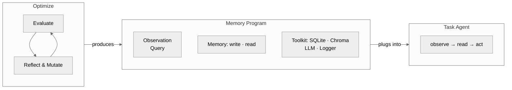

---
tags:
  - gepa
  - draft
created: 2026-02-27
---
相关笔记：[[Designing Programmatic Memory]] [[Combining Memory and GEPA]] [[Improving GEPA]] [[如何改进 GEPA-Memory]] [[Cheap Evaluation for LLM Agent Optimization]]
相关论文：[[../Papers/GEPA]] [[../Papers/StructMemEval]] [[../Papers/MemSkill]]

## Motivation

两个独立的观察推动了这个设计：

**观察一：记忆内容进化不可行。** 之前尝试用 GEPA 进化记忆条目本身（[[如何改进 GEPA-Memory]]），发现三个问题：模型编辑记忆缺乏策略性、单条记忆的效果难以验证、大多数样本不受单条记忆修改影响导致 rollout 效率极低。

**观察二：LLM 不会自主组织记忆结构。** [[../Papers/StructMemEval|StructMemEval]] 表明，现有 agent 在被告知如何组织记忆（hint）时表现良好，但无法独立识别正确的结构。现有系统（MemR³ 优化读、FluxMem 在三种预定义结构中选、MemSkill 用自然语言 skill）的设计空间都是封闭的——无法表达 task-specific 的计算逻辑（如 " 每收到一笔交易就更新净额 dict"）。

**结论：进化的对象应该是记忆程序（class-level），而非记忆内容（instance-level）。** 程序层面的改动影响所有样本的处理方式，验证信号更强，且能表达任意数据结构和计算逻辑。

## System Overview



核心思想：task agent 的 prompt 和模型保持固定，唯一变化的是 Memory Program 的代码。这使得性能差异完全归因于记忆程序的质量，提供了干净的优化信号。

## Memory Program 接口设计

```python
from __future__ import annotations
import json, re, math, hashlib, textwrap, sqlite3
from dataclasses import dataclass, field
from typing import Any, Optional
from collections import defaultdict, Counter
from datetime import datetime

import chromadb
from openai import OpenAI

class Toolkit:
    db: sqlite3.Connection   # in-memory SQLite
    chroma: chromadb.Client  # in-memory ChromaDB
    llm: OpenAI              # memory can call LLMs
    llm_model: str
    logger: Logger           # 用于记录 memory 内部关键状态

# === 以下为初始 memory program，也是进化的起点 ===

@dataclass
class Observation:
    raw: str

@dataclass
class Query:
    raw: str

class Memory:
    def __init__(self, tools: Toolkit) -> None:
        self.tools = tools
        self.history: list[str] = []

    def write(self, obs: Observation) -> None:
        # tip: use self.tools.logger.log(...) to record key internal states for debugging
        self.history.append(obs.raw)

    def read(self, query: Query) -> str:
        # tip: use self.tools.logger.log(...) to record retrieval decisions for debugging
        return "\n".join(self.history)
```

这是最简单的可运行 memory program：write 把所有 observation 追加到列表，read 无视 query 返回全部内容。它是进化的起点（seed），不需要单独的 seed generation 阶段——GEPA 直接从这个实现开始变异。

设计原则：

**为什么用代码而非自然语言 skill？** 自然语言 skill（如 MemSkill）的上限是 LLM 在推理时对 skill 的理解和执行能力。代码直接执行，没有理解偏差。更重要的是，代码可以维护任意数据结构（树、dict、状态机、账本），这是自然语言做不到的。

**为什么固定接口？** 限制搜索空间。GEPA 进化 prompt 时搜索空间已经很大，代码的搜索空间更大。固定 Observation/Query/Memory 三件套 + Toolkit，将进化限制在 " 如何解析、如何存储、如何检索 " 三个维度上，而非任意代码。

**为什么提供 Toolkit？** 三个工具覆盖三种记忆范式：SQLite 对应结构化存储（表、关系），ChromaDB 对应语义检索（向量相似度），weak LLM 对应需要理解/推理的操作（如总结、分类）。进化出的代码可以任意组合这三者。

## 进化循环

进化从上面的初始 memory program 开始，不需要单独的 seed generation 阶段。初始实现是最简单的 append-all / return-all，进化过程负责发现更好的结构。

### Phase 1: Evaluate

所有候选都走同一条管线。每个 dataset 有 train split 和 validation split，但不同类型的 dataset 在 split 构造和处理流程上有区别。

#### Dataset 格式处理

数据集按记忆交互模式分为两类：

**Type A: Batch-Ingest (如 LoCoMo)**。原始数据是对话记录、文档等需要被记忆的信息，配合独立的问答集。
- **Train**：将原始信息组织成一条条 observation，依次调用 Memory.write()，只写不读。
- **Validation**：逐个问题调用 Memory.read() 并回答，只读不写。

**Type B: Interleaved (如 ALFWorld, tau-bench)**。每个 sample 是一个完整的任务/QA，使用官方 train/validation 切分或自行切分。
- **Train**：每个 sample 走完整流程——read 辅助决策，生成 response，根据 feedback 和 ground truth 调用 write 更新 memory。
- **Validation**：只 read 不 write。

两种类型共享同一个 Memory Program 接口，区别仅在评估管线的调用方式。

#### 评估流程

一次评估 = 对一个 memory program 实例化一个新的 Memory 对象，跑完整个 dataset（train split 累积 memory，validation split 测试），返回 validation score。每次评估都从空 memory 开始，不同候选之间不共享状态。

`query_dataclass_schema` 和 `observation_dataclass_schema` 从当前 memory program 的 Query/Observation dataclass 定义自动生成（如通过 `dataclasses.fields()` 或 docstring）。

**Type A train sample 流程：**

```python
# Type A train: 纯写入，不需要 LLM 调用
obs = Observation(raw=raw_text)
memory.write(obs)
```

**Type B train sample 流程（使用 OpenAI Chat Completions 的 messages 结构，逐步追加 assistant/user turn）：**

```python
messages = []

# Step 1: generate query
messages.append({"role": "user", "content": f"""\
Given the following question, generate a query to retrieve relevant memory.

Question: {question}

The query must be a JSON object matching this schema:
{query_dataclass_schema}

Respond with the JSON only."""})

query_json = llm(messages)                        # → assistant turn
messages.append({"role": "assistant", "content": query_json})
query = Query(**json.loads(query_json))

# Step 2: read memory & generate response
retrieved = memory.read(query)
messages.append({"role": "user", "content": f"""\
<retrieved_memory>
{retrieved}
</retrieved_memory>

Based on the above memory and the original question, provide your answer."""})

response = llm(messages)                          # → assistant turn
messages.append({"role": "assistant", "content": response})

# Step 3: generate write input
messages.append({"role": "user", "content": f"""\
Evaluation result: {evaluation_result}
Ground truth: {ground_truth}

Based on this feedback, generate an observation to write into memory.

The observation must be a JSON object matching this schema:
{observation_dataclass_schema}

Respond with the JSON only."""})

write_json = llm(messages)                        # → assistant turn
obs = Observation(**json.loads(write_json))

# Step 4: update memory
memory.write(obs)
```

整个 sample 是一次多轮对话，context 逐步增长。每一步的输入都包含前面所有步骤的历史。

**Validation sample 流程（Type A 和 Type B 共用）：**

```python
messages = []

# Step 1: generate query
messages.append({"role": "user", "content": f"""\
Given the following question, generate a query to retrieve relevant memory.

Question: {question}

The query must be a JSON object matching this schema:
{query_dataclass_schema}

Respond with the JSON only."""})

query_json = llm(messages)                        # → assistant turn
messages.append({"role": "assistant", "content": query_json})
query = Query(**json.loads(query_json))

# Step 2: read memory & generate response
retrieved = memory.read(query)
messages.append({"role": "user", "content": f"""\
<retrieved_memory>
{retrieved}
</retrieved_memory>

Based on the above memory and the original question, provide your answer."""})

response = llm(messages)                          # → assistant turn
# 不做 Step 3/4，不写入 memory
```

Validation 只做 Step 1 + Step 2（生成 query、读取 memory、回答问题），不做 write。response 交给 dataset 的 score 函数评分。

#### Score 函数

每个 dataset 实现自己的 `score(response, ground_truth) -> float` 函数，定义由 dataset 决定（exact match、F1、LLM-as-judge 等）。接入新 dataset 时需要查阅其官方评估协议并实现对应的 score 函数。

**Compile & Smoke Test（零 rollout 成本）**
- 对代码跑 `compile()` 检查语法
- 实例化 Memory 对象 + 用固定输入跑一轮 write/read，捕获 runtime error
- 不通过直接淘汰。代码变异比 prompt 变异更脆弱（一个 bug 就全崩），这一层过滤掉大量无效候选

**Full Eval**
- 通过 smoke test 的候选跑完整个 dataset（train split 累积 + validation split 测试）
- 每个 dataset 得到一个分数（validation accuracy）
- 如果有多个 dataset，各 dataset 之间独立，可以并行

### Phase 2: Reflect & Mutate

单次调用反思 LLM，输入包含三部分，输出为诊断 + 完整的修改后代码。

#### 输入构造

```python
reflection_messages = [{"role": "system", "content": REFLECT_SYSTEM_PROMPT}]

reflection_messages.append({"role": "user", "content": f"""\
## Current Memory Program

{current_memory_program_code}

## Evaluation Score

Dataset: {dataset_name}
Score: {score} / {total}

## Failed Cases

{failed_cases_block}

## Task

1. Diagnose: analyze the failed cases and identify specific defects in the memory program.
2. Mutate: output the complete modified memory program (Observation, Query, Memory classes).
   Add comments at modified lines explaining the intent of each change.
"""})

mutated_code = llm(reflection_messages)

```

其中 `failed_cases_block` 从失败 case 中采样（控制总长度），每个 case 格式如下：

```

### Case {i} (expected: {ground_truth}, Got: {model_response})

<conversation_history>
{Phase 1 产生的完整 messages 历史，原样展示}
</conversation_history>

<memory_logs>
{该 case 执行过程中 memory program 通过 logger 输出的日志，可能为空}
</memory_logs>

```

#### 输出格式

反思 LLM 输出两部分：
1. 诊断分析（自由文本）
2. 完整的修改后 memory program 代码（包含 Observation, Query, Memory 三个定义），用代码块包裹

从输出中解析代码块，作为新的候选进入 Phase 1 评估。

### 循环逻辑

最简形式：单候选串行循环。

```
current = initial_memory_program
best_score = evaluate(current)

for iteration in range(max_iterations):
    child = reflect_and_mutate(current, failed_cases)
    if not smoke_test(child):
        continue
    child_score = evaluate(child)
    if child_score > best_score:
        current = child
        best_score = child_score
```

每轮只维护一个当前最优 program，变异产生一个 child，评估后决定是否替换。后续可扩展为候选池 + Pareto selection（多 dataset 多维信号），但初始实现先跑通这个最简循环。

## Testing

测试验证管线行为的正确性，不测算法有效性。所有涉及 LLM 调用的测试使用 mock：Toolkit 的 LLM 接口可替换，测试时注入一个 mock，对给定输入返回预设的合法 JSON 输出，不产生真实 API 调用。

### Toolkit

- SQLite：建表、插入、查询
- ChromaDB：add、query
- Logger：log 写入后能取回日志内容
- 以上均不需要 LLM

### Memory Program 生命周期

- 初始模板能实例化
- write 后 read 能返回写入的内容
- 重新实例化后 memory 是空的（状态不泄漏）

### Type A Train 管线

- 纯 write 调用，不触发 LLM
- write 后 memory 状态更新

### Type B Train 管线（mock LLM）

- 跑一个 sample，验证 messages 列表按预期增长（每步追加正确的 role）
- Step 1 的 mock 输出能被 parse 成 Query dataclass
- Step 3 的 mock 输出能被 parse 成 Observation dataclass
- write 被调用且 memory 状态更新

### Validation 管线（mock LLM）

- 跑一个 sample，验证只做 Step 1 + 2
- memory.write 未被调用

### Reflection Prompt 构造

- 给定 mock 的失败 case 列表，验证拼出的 prompt 包含：当前代码、score、case 格式正确（conversation_history 和 memory_logs 标签都在）

### 代码解析

- 正常输出（诊断文本 + 一个 python 代码块）：能提取代码
- 多个代码块：取最后一个（或报错，取决于策略）
- 无代码块：优雅失败，不崩溃
- 提取的代码缺少 import：在后续 smoke test 阶段捕获，parse 阶段不负责

### Smoke Test

- 语法错误的 memory program → 被 compile 拦截
- runtime error（如 read 里除零）→ 被 smoke test 拦截
- 合法的 memory program → 通过

## Benchmark 选择

理想的 benchmark 应满足：

1. **需要结构化记忆**：简单检索不够用（否则初始的 append-all baseline 就够了）
2. **数据量足够**：train split 有足够多的 sample 来积累有意义的 memory，validation split 有足够多的 question 来区分不同 memory program 的质量
3. **评估信号明确**：有清晰的 score 函数
4. **多个 dataset**：GEPA 的 Pareto selection 需要多维信号，每个 dataset 作为一个维度

候选：
- **StructMemEval**：专门测试记忆结构化能力（树、账本、状态机），直接对口。多种任务类型可作为多个独立 dataset
- **tau-bench**：多领域客服场景，需要记忆大量规则和上下文，experience-heavy
- **WebArena / OSWorld**：复杂交互任务，但评估成本很高

优先级：ALFWorld 和 LoCoMo 先开始。
