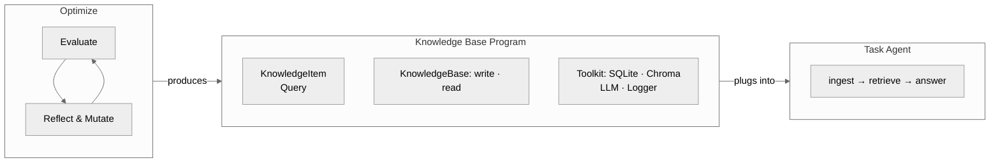

---
tags:
  - gepa
  - design
created: 2026-02-27
updated: 2026-03-05
---
相关笔记：[[Designing Programmatic Memory]] [[Combining Memory and GEPA]] [[Improving GEPA]] [[如何改进 GEPA-Memory]] [[Cheap Evaluation for LLM Agent Optimization]]
相关论文：[[../Papers/GEPA]] [[../Papers/StructMemEval]] [[../Papers/MemSkill]]

## Motivation

两个独立的观察推动了这个设计：

**观察一：记忆内容进化不可行。** 之前尝试用 GEPA 进化记忆条目本身（[[如何改进 GEPA-Memory]]），发现三个问题：模型编辑记忆缺乏策略性、单条记忆的效果难以验证、大多数样本不受单条记忆修改影响导致 rollout 效率极低。

**观察二：LLM 不会自主组织记忆结构。** [[../Papers/StructMemEval|StructMemEval]] 表明，现有 agent 在被告知如何组织记忆（hint）时表现良好，但无法独立识别正确的结构。现有系统（MemR³ 优化读、FluxMem 在三种预定义结构中选、MemSkill 用自然语言 skill）的设计空间都是封闭的——无法表达 task-specific 的计算逻辑（如 "每收到一笔交易就更新净额 dict"）。

**结论：进化的对象应该是记忆程序（class-level），而非记忆内容（instance-level）。** 程序层面的改动影响所有样本的处理方式，验证信号更强，且能表达任意数据结构和计算逻辑。

## System Overview



核心思想：task agent 的 prompt 和模型保持固定，唯一变化的是 Knowledge Base Program 的代码。这使得性能差异完全归因于知识库程序的质量，提供了干净的优化信号。

## Knowledge Base Program 接口设计

一个 **Knowledge Base Program**（代码类型：`KBProgram`）是一个完整的 Python 模块，包含三个类和四个模块级字符串常量：

```python
from __future__ import annotations
from dataclasses import dataclass, field

# === 四个必需的模块级指令常量 ===

INSTRUCTION_KNOWLEDGE_ITEM = "Summarize the key information from the text."
INSTRUCTION_QUERY = "Given the following question, generate a query to retrieve relevant knowledge."
INSTRUCTION_RESPONSE = "Based on the above knowledge and the original question, provide a short answer without explanation."
ALWAYS_ON_KNOWLEDGE = ""

# === 三个必需的类 ===

@dataclass
class KnowledgeItem:
    """A summary of what was learnt from the source text."""
    summary: str = field(metadata={"description": "What you have learnt from the text"})

@dataclass
class Query:
    """Raw text query to retrieve from the knowledge base."""
    raw: str = field(metadata={"description": "The query text to search for"})

class KnowledgeBase:
    """Simple append-all / return-all knowledge base."""

    def __init__(self, toolkit):
        self.toolkit = toolkit
        self.summaries: list[str] = []
        self.observations: list[str] = []

    def write(self, item: KnowledgeItem, raw_text: str) -> None:
        self.summaries.append(item.summary)
        self.observations.append(raw_text)
        self.toolkit.logger.debug(f"Stored summary: {item.summary}")

    def read(self, query: Query) -> str:
        self.toolkit.logger.debug(f"Query: {query.raw}, summaries: {len(self.summaries)}")
        if not self.summaries and not self.observations:
            return "No information stored."
        summary_text = "\n".join(self.summaries)[:500]
        observation_text = "\n".join(self.observations)[:500]
        result = summary_text + "\n" + observation_text
        return result[:1000]
```

这是 `INITIAL_KB_PROGRAM`——进化的起点（seed）。它维护两个列表（`summaries` 来自 LLM 摘要，`observations` 来自原始文本），read 时简单拼接并截断到 1000 字符。不需要单独的 seed generation 阶段——进化直接从这个实现开始变异。

### Toolkit 接口

Knowledge Base Program 通过 `toolkit` 参数获取三种资源：

```python
class Toolkit:
    db: sqlite3.Connection       # in-memory SQLite
    chroma: chromadb.EphemeralClient  # in-memory ChromaDB
    logger: MemoryLogger         # debug logging

    def llm_completion(self, messages: list[dict], **kwargs) -> str:
        """Budget-limited LLM call (default 50 calls per evaluation)."""
        ...
```

- **SQLite** 对应结构化存储（表、关系、聚合查询）
- **ChromaDB** 对应语义检索（向量相似度搜索）
- **LLM** 对应需要理解/推理的操作（如总结、分类），budget 限制避免过度使用
- **Logger** 用于调试——日志在反思阶段可见，帮助 LLM 诊断问题

### 指令常量

四个模块级字符串常量控制 task agent 的行为：

| 常量 | 用途 | 注入位置 |
|---|---|---|
| `INSTRUCTION_KNOWLEDGE_ITEM` | 指导 task LLM 如何从原始文本提取 KnowledgeItem | KnowledgeItem 生成 prompt |
| `INSTRUCTION_QUERY` | 指导 task LLM 如何构造 Query | Query 生成 prompt |
| `INSTRUCTION_RESPONSE` | 控制 task LLM 回答的格式、长度、风格 | 检索后回答 prompt |
| `ALWAYS_ON_KNOWLEDGE` | 持续性知识，注入每个 task agent prompt | `<retrieved_memory>` 标签内，retrieved 文本之前 |

前三个不可为空；`ALWAYS_ON_KNOWLEDGE` 可以为空。进化可以修改这些常量来调整 task agent 的行为，与修改代码逻辑互补。

### 运行时约束

| 约束 | 限制 | 违反后果 |
|---|---|---|
| `read()` 输出长度 | 最多 1000 字符 | `RuntimeViolationError` |
| `write()` / `read()` 超时 | 每次调用最多 5 秒 | `RuntimeViolationError` |
| `toolkit.llm_completion()` 调用次数 | 每次评估最多 50 次 | `RuntimeError` |

`_guarded_write()` 和 `_guarded_read()` 使用 `ThreadPoolExecutor` 强制执行超时和输出长度限制。违反导致该次评估得分为 0。

### 设计原则

**为什么用代码而非自然语言 skill？** 自然语言 skill（如 MemSkill）的上限是 LLM 在推理时对 skill 的理解和执行能力。代码直接执行，没有理解偏差。更重要的是，代码可以维护任意数据结构（树、dict、状态机、账本），这是自然语言做不到的。

**为什么固定接口？** 限制搜索空间。固定 KnowledgeItem/Query/KnowledgeBase 三件套 + Toolkit，将进化限制在 "如何解析、如何存储、如何检索" 三个维度上，加上四个指令常量控制 task agent 行为。

**为什么 `write(item, raw_text)` 同时接收 KnowledgeItem 和原始文本？** `item` 是 task LLM 根据当前 KnowledgeItem schema 生成的结构化摘要；`raw_text` 是未经处理的原始源文本。Knowledge Base Program 可以选择只用 `item`（信赖 LLM 摘要），只用 `raw_text`（自己处理），或两者结合。

**为什么提供 Toolkit？** 三个工具覆盖三种记忆范式：SQLite 对应结构化存储（表、关系），ChromaDB 对应语义检索（向量相似度），weak LLM 对应需要理解/推理的操作（如总结、分类）。进化出的代码可以任意组合这三者。

### 允许的导入

Knowledge Base Program 只能使用白名单内的模块：

```
json, re, math, hashlib, collections, dataclasses, typing, datetime, textwrap, sqlite3, chromadb
```

`sandbox.py` 的 AST 验证器在编译阶段检查所有 import 语句。

### KnowledgeItem/Query 字段约束

字段类型必须是 JSON 兼容的：`str`, `int`, `float`, `bool`, `list[str]`, `Optional[str]`。不可使用 `datetime`, `tuple`, `bytes` 或自定义对象——task LLM 生成 JSON，直接传给 dataclass 构造函数：`ki_cls(**_parse_json_from_llm(llm_output))`。

`field(metadata={"description": "..."})` 可以给字段添加描述，`extract_dataclass_schema()` 会把描述展示给生成 JSON 的 task LLM。

## 进化循环

### Phase 1: Evaluate

一次评估 = 对一个 Knowledge Base Program 实例化一个新的 KnowledgeBase 对象，跑完整个 dataset（train split 累积知识，validation split 测试检索），返回 validation score。每次评估都从空知识库开始，不同候选之间不共享状态。

#### 两类 LLM 调用

1. **Task agent LLM**（`evaluator.py:_batch_llm_call`）——评估管线中的独立 `litellm.batch_completion` 调用，负责生成 KnowledgeItem/Query JSON 和回答问题。模型和 prompt 固定，不受进化影响。
2. **Toolkit LLM**（`toolkit.py:Toolkit.llm_completion`）——给 Knowledge Base Program 内部使用的 LLM，有 budget 限制（默认 50 次），带 tenacity 重试（3 次，指数退避 1-10s）。

#### 数据集类型与训练管线

训练管线由数据自动推断，不使用显式的模式枚举：

**Offline（batch-ingest，`train_data[0].raw_text` 为真）：** 如 LoCoMo、kv_memory。原始数据是文档/对话，配合独立问答集。

```python
# 1. 批量 KnowledgeItem 生成（一次 batch_completion 处理所有 train items）
all_prompts = [build_knowledge_item_generation_prompt(item.raw_text, ki_schema, instruction_ki)
               for item in train_data]
ki_responses = _batch_llm_call(all_prompts, json_mode=True)

# 2. 逐条解析并写入（串行，因为 kb.write() 可能有内部状态依赖）
for item, response in zip(train_data, ki_responses):
    ki = ki_cls(**_parse_json_from_llm(response))
    _guarded_write(kb, ki, item.raw_text)
```

**Online（interleaved，`train_data[0].raw_text` 为假）：** 如 tau-bench、nyt_connections。每个 sample 是一个完整的 QA 任务。三轮批量 LLM 调用：

```python
# Round 1: 批量生成 Query
query_prompts = [build_query_generation_prompt(item.question, query_schema, instruction_query)
                 for item in train_data]
query_responses = _batch_llm_call(query_prompts, json_mode=True)

# 串行执行 kb.read()（因为知识库有状态）
for slot in slots:
    query = query_cls(**_parse_json_from_llm(slot.response))
    retrieved = _guarded_read(kb, query)

# Round 2: 批量生成回答（多轮对话，包含 query + 检索结果）
answer_prompts = [build_retrieved_memory_prompt(slot.retrieved, instruction_response, always_on_knowledge)
                  for slot in slots]
# 每个 prompt 附加到该 item 的完整 messages 历史中
answer_responses = _batch_llm_call(all_messages)

# Round 3: 批量生成 KnowledgeItem（带反馈）
feedback_prompts = [build_knowledge_item_with_feedback_prompt(
    evaluation_result, ground_truth, ki_schema, instruction_ki)
                    for slot in slots]
ki_responses = _batch_llm_call(all_messages, json_mode=True)

# 串行写入
for slot, response in zip(slots, ki_responses):
    ki = ki_cls(**_parse_json_from_llm(response))
    _guarded_write(kb, ki, raw_text="")
```

Online 训练中，每个 sample 的完整对话历史（messages 列表）在三轮间逐步累积。

#### Validation 管线

Validation 分两阶段，Offline 和 Online 共用同一流程：

**阶段 1：共享检索（`_retrieve_for_val`）**
```python
# 批量生成 Query
query_prompts = [build_query_generation_prompt(item.question, query_schema, instruction_query)
                 for item in val_data]
query_responses = _batch_llm_call(query_prompts, json_mode=True)

# 串行 kb.read()
for slot in slots:
    query = query_cls(**_parse_json_from_llm(slot.response))
    retrieved = _guarded_read(kb, query)
```

**阶段 2：评分（两种路径）**

- **默认路径（`_default_answer_and_score`）：** 批量生成回答 → scorer 评分。大多数 benchmark 使用此路径。
- **自定义路径（`_val_scorer_path`）：** 当 `Dataset.val_scorer` 存在时，调用 `val_scorer.score_batch()` 替代默认的 LLM 回答 + string scorer。用于需要环境交互的 benchmark（如 ALFWorld 需要在 TextWorld 环境中执行动作）。

两条路径都将检索对话历史写入 `FailedCase.conversation_history`，供反思阶段诊断。

#### Score 函数

每个 dataset 绑定自己的 `Scorer`（`score(output, expected) -> float`）：

| Scorer | 评分方式 | 使用 benchmark |
|---|---|---|
| `ExactMatchScorer` | 归一化后子串匹配（小写、去标点、压缩空白）| kv_memory, tau_bench |
| `TokenF1Scorer` | SQuAD 风格 token F1（去 a/an/the）| locomo, mini_locomo |
| `LLMJudgeScorer` | LLM-as-judge，返回 0.0 或 1.0 | 可选 |
| `ConnectionsScorer` | 解析分组，精确匹配组数 / 4（部分得分）| nyt_connections |
| `ALFWorldValScorer` | 在 TextWorld 环境中执行 episode，二值成功/失败 | alfworld |

### Phase 2: Reflect & Mutate

单次调用反思 LLM（`REFLECT_MODEL`），输入为结构化 prompt，输出为诊断 + V4A patch。

#### 输入构造

反思 prompt 使用 user-only message（无 system prompt），包含以下 XML 结构化段落：

```xml
<interface_spec>...</interface_spec>          <!-- KB_INTERFACE_SPEC: 接口规范、运行时约束 -->
<patch_format>...</patch_format>              <!-- PATCH_FORMAT_SPEC: V4A patch 格式说明 -->
<current_program iteration="N">...</current_program>  <!-- 当前 KB Program 源码 -->
<evaluation_score>0.xxx</evaluation_score>    <!-- 当前得分 -->

<!-- 可选段落 -->
<write_examples>...</write_examples>          <!-- 训练时的 write 轨迹样例 -->
<memory_debug_logs>...</memory_debug_logs>    <!-- 去重后的 toolkit.logger.debug() 日志 -->
<success_cases>...</success_cases>            <!-- 成功案例（保留有效行为） -->

<!-- 必需段落 -->
<failed_cases>                                <!-- 失败案例 -->
  <case id="1">
    <question>...</question>
    <expected>...</expected>
    <model_generation>...</model_generation>
    <score>...</score>
    <conversation>
      [user]: ...
      [assistant]: ...
    </conversation>
    <memory_logs>...</memory_logs>            <!-- 仅当日志未去重时出现 -->
  </case>
</failed_cases>

<task>
1. Diagnose why these cases fail.
2. Propose specific improvements to the Knowledge Base Program.
3. Output your changes as a patch.
</task>
```

`ReflectionPromptConfig` 控制内容限制：
- `max_failed_cases = 2`
- `max_success_cases = 1`
- `max_train_examples = 1`
- `max_memory_log_chars = 0`（默认关闭日志）

长消息通过 `_truncate_msg()` 截断（保留首尾各 5000 字符，中间省略）。相同的 memory logs 在多个失败案例间去重，只渲染一次。

#### 输出格式

反思 LLM 输出两部分：
1. 诊断分析（自由文本）
2. V4A patch（`*** Begin Patch ... *** End Patch`）

`_extract_patch()` 从输出中提取最后一个 patch 块，`apply_patch()` 通过 `codex-apply-patch` 库将 patch 应用到当前源码上，生成新的完整代码。

#### 验证与修复循环

```python
def reflect_and_mutate(current, eval_result, iteration):
    # 1. 生成 patch 并应用
    prompt = build_reflection_user_prompt(...)
    llm_output = llm(prompt)
    patch = _extract_patch(llm_output)
    new_code = apply_patch(current.source_code, patch)

    # 2. 验证：compile + smoke_test
    error = _validate_code(new_code)

    # 3. 如果验证失败，compile-fix 循环（最多 max_fix_attempts 次）
    for attempt in range(max_fix_attempts):
        if error is None:
            break
        fix_prompt = build_compile_fix_prompt(new_code, error_type, error_details)
        fix_output = llm(fix_prompt)
        fix_patch = _extract_patch(fix_output)
        new_code = apply_patch(new_code, fix_patch)
        error = _validate_code(new_code)

    # 4. 返回验证通过的 KBProgram，或 None
    return KBProgram(new_code, generation=iteration+1, parent_hash=current.hash)
```

#### Runtime Violation 修复

在进化循环中，如果评估发现 `runtime_violation`（超时或输出过长），loop.py 会调用 `reflector.fix_runtime_violation()` 尝试修复（最多 `max_fix_attempts` 次），重新评估直到修复成功或放弃。

### 循环逻辑

```python
current = initial_kb_program
eval_result = evaluate(current, train_data, val_data)
best_score = eval_result.score
best_program = current

for iteration in range(max_iterations):
    if stop_condition(state):
        break

    # 反思 + 变异（含 compile-fix）
    child = reflector.reflect_and_mutate(current, eval_result, iteration)
    if child is None:
        continue  # 变异失败，跳过

    # 评估
    child_result = evaluate(child, train_data, val_data)

    # Runtime violation 修复循环
    while child_result.runtime_violation:
        fixed = reflector.fix_runtime_violation(child.source_code, violation)
        if fixed is None:
            break
        child = KBProgram(fixed, ...)
        child_result = evaluate(child, train_data, val_data)

    # 更新最优
    if child_result.score > best_score:
        best_score = child_result.score
        best_program = child

    # 是否继续使用 child（默认 True）
    if drop_degraded_program and child_result.score < best_score:
        current = best_program  # 回退到最优
    else:
        current = child  # 总是前进（即使退化）
    eval_result = child_result
```

单候选串行循环。默认总是使用最新的 child（即使分数下降），因为退化的代码可能包含有价值的结构变化，下一轮反思可以在此基础上修复。`drop_degraded_program=True` 模式在退化时回退到历史最优。

## Compile & Smoke Test

代码变异比 prompt 变异更脆弱（一个 bug 就全崩），零 rollout 成本的验证层过滤掉大量无效候选。

**`compile_kb_program(source_code)`：**
1. `ast.parse()` 检查语法
2. AST 验证器检查 `KnowledgeItem`、`Query`、`KnowledgeBase` 三个类存在
3. `_ImportValidator` 检查所有 import 在白名单内
4. `exec()` 执行代码（白名单 import 预注入命名空间）
5. 检查四个必需常量（`INSTRUCTION_KNOWLEDGE_ITEM`、`INSTRUCTION_QUERY`、`INSTRUCTION_RESPONSE`、`ALWAYS_ON_KNOWLEDGE`）存在且为字符串
6. 返回 `CompiledProgram`（`ki_cls`, `query_cls`, `kb_cls`, 四个常量）或 `CompileError`

**`smoke_test(source_code, toolkit_config)`：**
- 编译代码，实例化 KnowledgeBase
- 用 dummy KnowledgeItem 跑一轮 `write()`
- 用 dummy Query 跑一轮 `read()`
- 在 ThreadPoolExecutor 中执行，10 秒超时
- 返回 `SmokeTestResult(success, error)`

## Benchmarks

### kv_memory（简单事实检索）

- **数据**：程序生成的简单事实 + 复合推理问题
- **Train**：有 `raw_text`（Offline pipeline）
- **Scorer**：`ExactMatchScorer`
- **参数**：`num_items`, `difficulty` (simple/compound), `seed`

### locomo（多会话长对话 QA）

- **数据**：SNAP Research LoCoMo 数据集，~10 个对话，~1000 个 QA 对
- **Train**：会话转录（含日期/时间/说话者），有 `raw_text`（Offline）
- **Scorer**：`TokenF1Scorer`
- **参数**：`num_conversations`, `categories`, `seed`

### mini_locomo（单对话 LoCoMo 子集）

- **数据**：LoCoMo 单个对话的快速迭代版本
- **Train**：无 `raw_text`（Online pipeline，3 轮交互训练）
- **Scorer**：`TokenF1Scorer`
- **参数**：`num_val`, `categories` (1-4), `seed`

### tau_bench（零售/航空客服任务）

- **数据**：从 sierra-research/tau-bench GitHub 解析 `tasks.py` + `wiki.md`
- **Train**：无 `raw_text`（Online pipeline）
- **Scorer**：`ExactMatchScorer`
- **参数**：`domain` (retail/airline), `train_ratio`, `seed`

### alfworld（具身任务完成）

- **数据**：ALFRED 轨迹，从 GitHub Releases 下载（json + tw-pddl，~112MB）
- **Train**：专家 episode 转录（ACTION/OBSERVATION 对），有 `raw_text`（Offline）
- **Val**：通过 `ALFWorldValScorer` 在 TextWorld 环境中实际执行 episode
- **Scorer**：二值成功/失败（自定义 `ValScorer`）
- **参数**：`max_steps=50`, `max_workers=20`, `episode_timeout=300.0`
- **依赖**：`pip install -e ".[alfworld]"`，无 alfworld 包时回退到默认 LLM 回答路径

### nyt_connections（词组分组谜题）

- **数据**：HuggingFace `tm21cy/NYT-Connections`，652 个谜题
- **Train**：无 `raw_text`（Online pipeline）
- **Scorer**：`ConnectionsScorer`（精确匹配组数 / 4，部分得分 0.25/组）
- **参数**：`train_ratio`, `seed`

### 接入新 benchmark

1. 在 `benchmarks/` 下创建模块
2. 用 `@register_dataset(name)` 装饰加载函数
3. 返回 `Dataset(train, val, scorer=..., val_scorer=...)`
4. 在 `benchmarks/__init__.py` 中导入新模块
5. 如需自定义 val 评分，实现 `ValScorer` protocol

## 扩展机制：ValScorer Protocol

当 pipeline 需要 benchmark 特定的 val 评分行为时，使用 Protocol 扩展：

```python
class ValScorer(Protocol):
    def score_batch(self, items, retrieved, task_model, instruction_response, always_on_knowledge):
        """返回 list[tuple[str, float]]，每个元素是 (output_text, score)。"""
        ...
```

- `Dataset.val_scorer`（可选）设置后，evaluator 调用 `_val_scorer_path()` 替代 `_default_answer_and_score()`
- 共享前缀 `_retrieve_for_val()` 不变（Query 生成 + kb.read()）
- Benchmark 模块提供实现（如 `ALFWorldValScorer`），可用 `try: import; except ImportError` 保护

## 模块结构

```
src/programmaticmemory/
├── evolution/
│   ├── types.py             # KBProgram, Dataset, DataItem, EvalResult, FailedCase, TrainExample,
│   │                        # EvolutionRecord, EvolutionState, Scorer/ValScorer protocol
│   ├── evaluator.py         # MemoryEvaluator: offline/online 管线, scorers (ExactMatch/TokenF1/LLMJudge),
│   │                        # _guarded_write/_guarded_read, _batch_llm_call, _parse_json_from_llm
│   ├── reflector.py         # Reflector: LLM 反思 + patch 生成 + compile-fix 循环 + runtime violation 修复
│   ├── sandbox.py           # compile_kb_program, smoke_test, extract_dataclass_schema,
│   │                        # CompiledProgram, CompileError, SmokeTestResult
│   ├── toolkit.py           # Toolkit (SQLite, ChromaDB, llm_completion, logger), ToolkitConfig, MemoryLogger
│   ├── prompts.py           # KB_INTERFACE_SPEC, INITIAL_KB_PROGRAM, PATCH_FORMAT_SPEC,
│   │                        # ReflectionPromptConfig, build_*_prompt 函数
│   ├── loop.py              # EvolutionLoop: 主 GEPA 循环
│   ├── patcher.py           # apply_patch: codex-apply-patch 包装
│   └── __main__.py          # CLI 入口
├── benchmarks/
│   ├── __init__.py          # 导入所有 benchmark 模块触发 @register_dataset
│   ├── kv_memory.py         # 简单事实检索
│   ├── locomo.py            # 多会话长对话 QA
│   ├── mini_locomo.py       # 单对话 LoCoMo 子集
│   ├── tau_bench.py         # 零售/航空客服
│   ├── alfworld.py          # 具身任务 + ALFWorldValScorer
│   ├── nyt_connections.py   # 词组分组谜题 + ConnectionsScorer
│   └── _download.py         # 下载工具（stdlib: urllib, tarfile, zipfile）
├── logging/
│   ├── logger.py            # RichLogger (全局单例 via get_logger()/set_logger())
│   ├── experiment_tracker.py # ExperimentTracker (wandb/weave)
│   └── run_output.py        # RunOutputManager + LLMCallLogger (litellm callback)
├── datasets.py              # register_dataset, load_dataset, list_datasets (懒加载)
├── cache.py                 # configure_cache (disk/redis/r2/s3), disable_cache
└── utils/
    └── stop_condition.py    # StopperProtocol, SignalStopper (graceful SIGINT/SIGTERM)
```

## Testing

测试验证管线行为的正确性，不测算法有效性。

### 测试基础设施

- **Pytest markers**：`@pytest.mark.llm`（真实 LLM 调用）、`@pytest.mark.uses_chroma`（真实 ChromaDB）、`@pytest.mark.alfworld`（需要 alfworld 包）
- **LLM 磁盘缓存**：`tests/evolution/.llm_cache/`——litellm 磁盘缓存提交到 git，LLM 测试无需 API key 即可重放。缓存 key 包含所有 API 参数（model, messages, temperature, max_tokens, response_format），修改任何参数会导致缓存未命中。
- **Syrupy 快照**：`tests/evolution/__snapshots__/*.ambr`——4 个快照文件：
  - `test_prompts.ambr`——prompt 模板输出
  - `test_evaluator.ambr`——完整 `captured_calls`（每个测试发送给 mock LLM 的所有消息）
  - `test_reflector.ambr`——反思 LLM 调用消息
  - `test_llm_integration.ambr`——`{prompt, output}` dict（真实 LLM 响应）
- **ChromaDB mock**：`conftest.py` 自动 mock `chromadb.EphemeralClient`；用 `@pytest.mark.uses_chroma` 退出 mock
- **批量 LLM mock**：评估器测试使用 `_make_batch_mock(response_batches)` + `mock_litellm.batch_completion = batch_mock`

### 测试策略

- 涉及 prompt 的测试必须使用 syrupy 快照，确保 prompt 变更可被人工审查
- `prompts.py` 的修改会级联影响 `test_prompts.ambr` 和 `test_reflector.ambr`——修改后需同时 `--snapshot-update`
- `evaluator.py` 的修改（包括添加 log 调用）会级联影响 `test_evaluator.ambr`
- LLM 集成测试使用两个模型层：`MODEL`（gpt-5.1-codex-mini，便宜）仅用于 task agent，`REFLECT_MODEL`（gpt-5.3-codex，更强）用于所有代码生成（反思、compile-fix、runtime-fix）

## CLI 用法

```bash
# 在 kv_memory 上跑 3 轮进化
uv run python -m programmaticmemory.evolution --iterations 3 num_items=10

# 在 mini_locomo 上快速迭代（无 weave 追踪）
uv run python -m programmaticmemory.evolution --dataset mini_locomo --iterations 3 --no-weave

# 完整参数
uv run python -m programmaticmemory.evolution \
    --dataset locomo \
    --iterations 10 \
    --task-model openrouter/deepseek/deepseek-v3.2 \
    --reflect-model openrouter/openai/gpt-5.3-codex \
    --train-size 50 --val-size 20 \
    --seed 42 \
    --reflection-max-failed-cases 3 \
    --reflection-max-train-examples 2 \
    --reflection-max-memory-log-chars 2000 \
    --drop-degraded-program \
    key=value  # benchmark 特定参数
```

### 本地输出结构

```
outputs/2024-01-15-12-34-56/
├── config.json              # 运行配置
├── run.log                  # RichLogger 输出镜像
├── summary.json             # 最终指标汇总
├── programs/
│   ├── iter_0.py            # 初始程序（含分数注释）
│   ├── iter_1.py            # 第 1 轮变异结果
│   └── ...
└── llm_calls/
    ├── iter_0/
    │   ├── train_001.json   # 每次 LLM 调用的完整请求/响应
    │   ├── reflect_001.json
    │   └── failed_cases.json
    └── iter_1/
        └── ...
```

## 追踪与日志

- **Wandb/Weave**：默认开启（`--no-weave` 关闭）。`@weave.op()` 装饰 `EvolutionLoop.run`、`MemoryEvaluator.evaluate`、`Reflector.reflect_and_mutate`、`smoke_test`。litellm 调用通过 `weave[litellm]` 依赖自动追踪。
- **RichLogger**：全局单例（`get_logger()`），支持 Rich console 彩色输出 + 文件镜像。日志头：`EVOLUTION`（循环）、`EVAL`（评估）、`REFLECT`（反思）、`CONFIG`（启动）、`OUTPUT`（文件保存）。
- **LLMCallLogger**：litellm `CustomLogger` 回调，零侵入记录每次 LLM 调用到 JSON 文件。
